# 💸 SplitFlow

**Grup masraflarını hesapla, Stellar blockchain üzerinden öde.**

SplitFlow, arkadaşlarınızla yaptığınız gezilerde, etkinliklerde veya ortak harcamalarda masrafları adil bir şekilde bölmenizi ve Stellar blockchain üzerinden güvenli ödemeler yapmanızı sağlayan modern bir web uygulamasıdır.

[](https://stellar.org)
[](https://soroban.stellar.org)
[](https://www.freighter.app)

---

## ✨ Özellikler

### 🔐 Blockchain Entegrasyonu
- **Freighter Wallet** ile güvenli bağlantı
- **Stellar Path Payment** ile esnek ödeme seçenekleri
- **Testnet** üzerinde gerçek blockchain işlemleri
- Tüm ödemeler blockchain'de şeffaf ve doğrulanabilir

### 📊 Akıllı Hesaplama
- Otomatik borç hesaplama algoritması
- Minimum transfer sayısı ile optimal ödeme planı
- Gerçek zamanlı bakiye takibi
- Detaylı borç grafiği görselleştirmesi

### 🎯 Kullanıcı Dostu Arayüz
- Modern ve profesyonel tasarım
- Canlı Horizon SSE stream ile anlık bildirimler
- QR kod ile kolay grup daveti
- Karma puanlama sistemi
- Kategori bazlı harcama analizi

### 🚀 Demo Modu
- 5 mock kullanıcı ile zengin demo ortamı
- 14 örnek harcama senaryosu
- Gerçek Freighter ödemeleri test edebilme
- Yerel test için mock adres desteği

---

## 📸 Ekran Görüntüleri

### Cüzdana Bağlanma
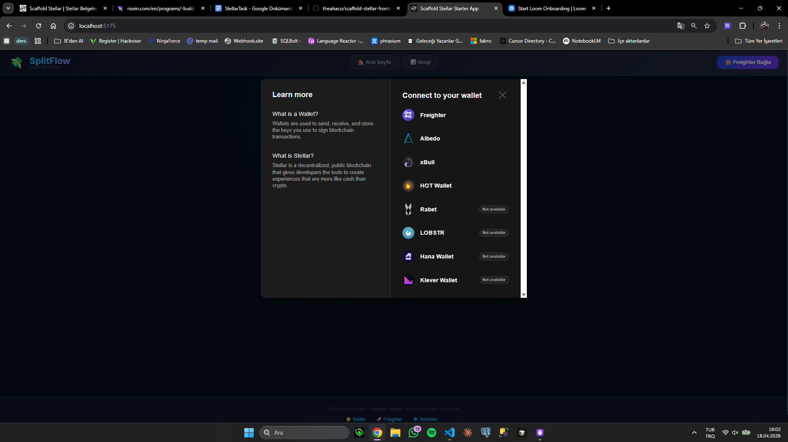

### Grup Oluşturma
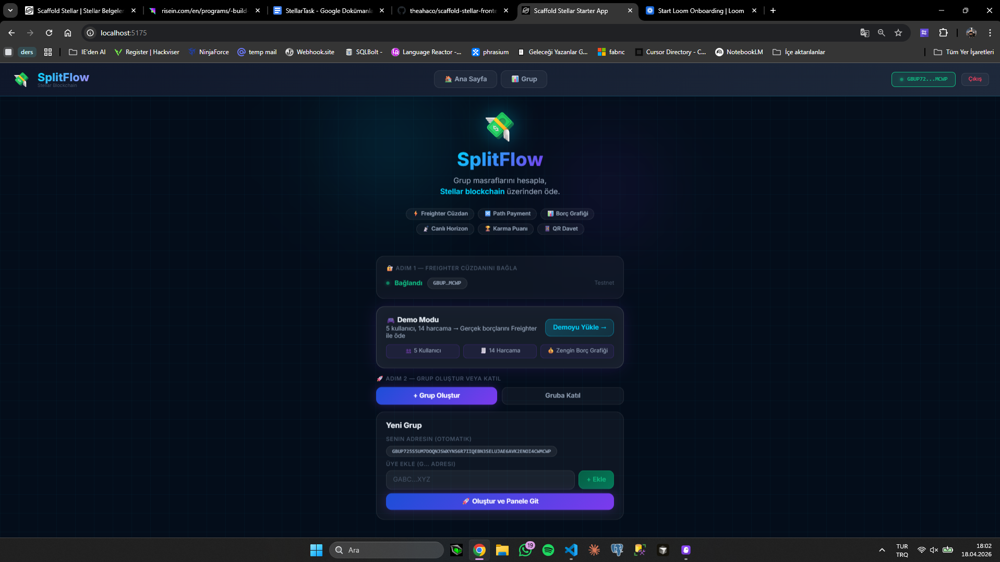

### Gruba Katılma (QR Kod)
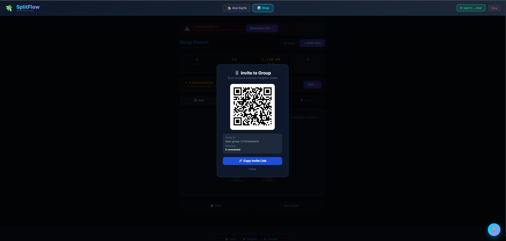
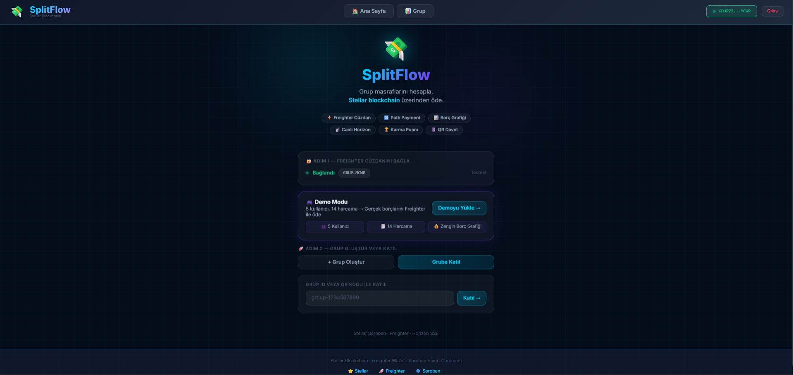

### Grup Paneli
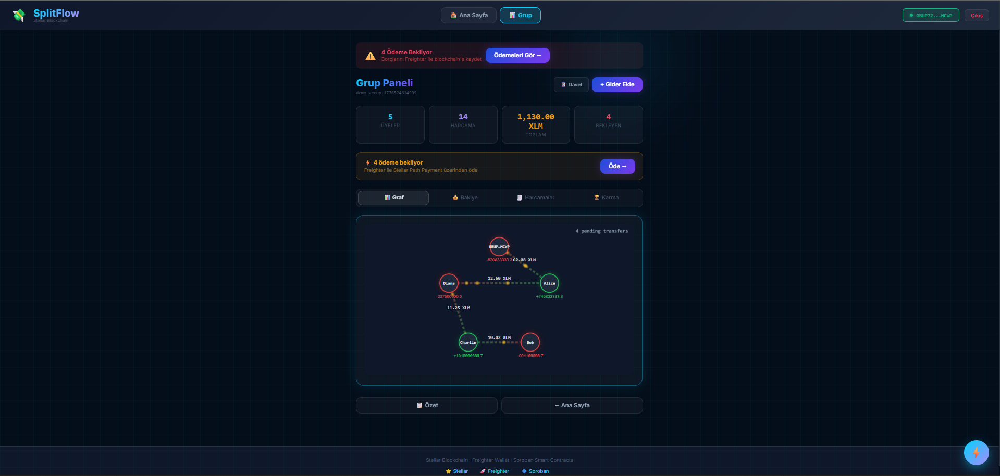

### Borç Grafiği
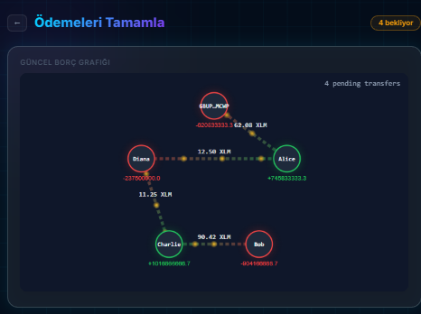

### Harcamalar
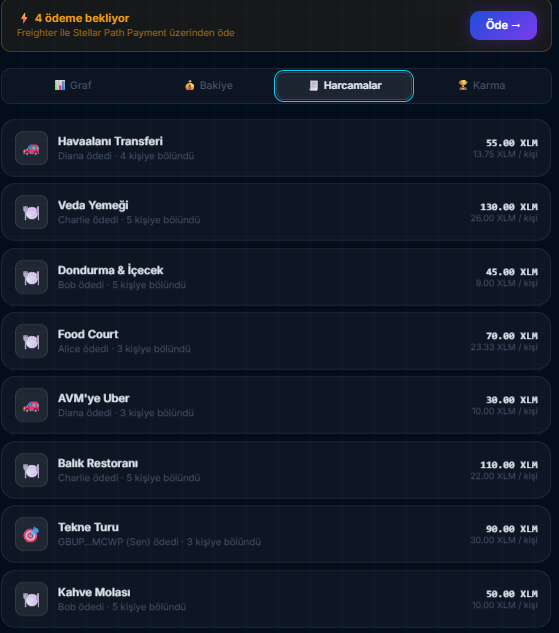

### Gider Oluşturma
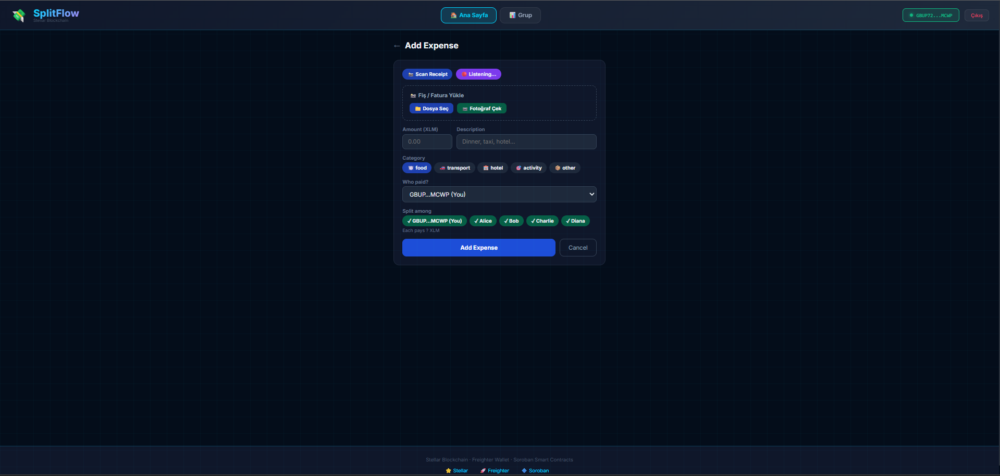

### Canlı Bakiye
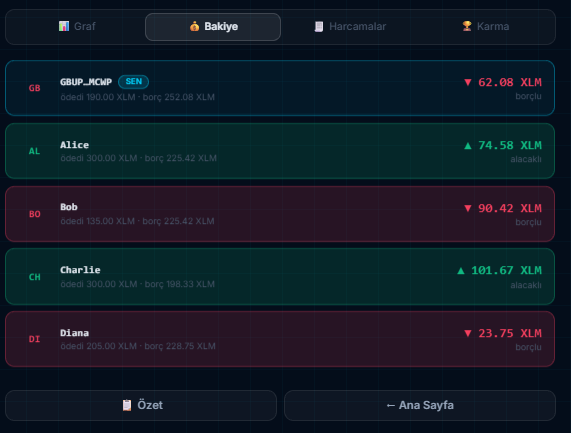

### Ödemeler
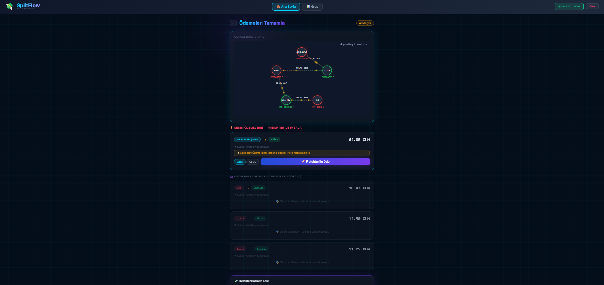

### Ödeme Aşaması
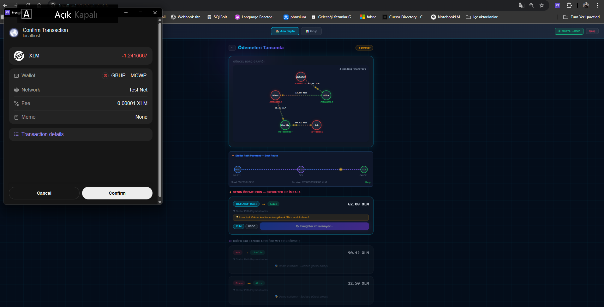

### Gezi Özeti
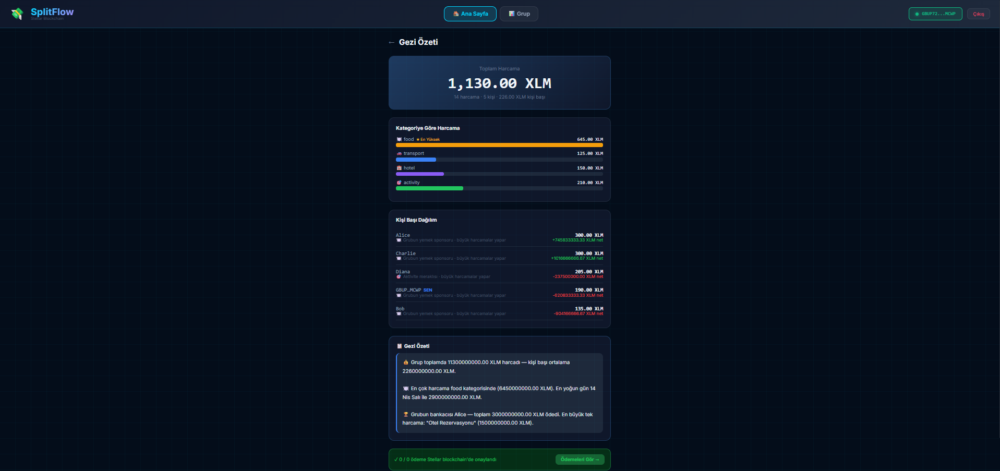

---

## 🛠️ Teknolojiler

### Frontend
- **React 18** + **TypeScript**
- **Vite** - Hızlı build tool
- **React Router** - Sayfa yönlendirme
- Modern CSS3 animasyonlar

### Blockchain
- **Stellar SDK** - Blockchain entegrasyonu
- **Soroban** - Smart contract desteği
- **Freighter API** - Cüzdan bağlantısı
- **Horizon API** - Gerçek zamanlı işlem takibi

### Algoritmalar
- Minimum transfer hesaplama
- Borç grafiği optimizasyonu
- Path payment routing
- Karma puanlama sistemi

---

## 🚀 Kurulum

### Gereksinimler
- Node.js 18+
- npm veya yarn
- Freighter Wallet tarayıcı uzantısı

### Adımlar

1. **Projeyi klonlayın**
```bash
git clone https://github.com/ensar-sencan/shared-trip-with-friends.git
cd shared-trip-with-friends
```

2. **Bağımlılıkları yükleyin**
```bash
npm install
```

3. **Geliştirme sunucusunu başlatın**
```bash
npm run dev
```

4. **Tarayıcıda açın**
```
http://localhost:5173
```

### Freighter Wallet Kurulumu

1. [Freighter Wallet](https://www.freighter.app) uzantısını yükleyin
2. Yeni bir cüzdan oluşturun veya mevcut cüzdanınızı içe aktarın
3. Ağı **Test Network** olarak ayarlayın
4. SplitFlow'da "Freighter Bağla" butonuna tıklayın

---

## 📖 Kullanım

### 1. Cüzdan Bağlantısı
- Freighter Wallet'ı yükleyin ve Test Network'e geçin
- "Freighter Bağla" butonuna tıklayın
- Bağlantıyı onaylayın

### 2. Grup Oluşturma
- "Grup Oluştur" butonuna tıklayın
- Üye Stellar adreslerini ekleyin (G ile başlayan 56 karakter)
- Grubu oluşturun

### 3. Demo Modu (Önerilen)
- "Demoyu Yükle" butonuna tıklayın
- 5 kullanıcı ve 14 harcama ile zengin bir senaryo yüklenir
- Gerçek Freighter ödemeleri test edebilirsiniz

### 4. Harcama Ekleme
- Grup panelinde "+ Gider Ekle" butonuna tıklayın
- Harcama detaylarını girin (tutar, açıklama, kategori)
- Harcamayı kimlerin paylaşacağını seçin

### 5. Ödeme Yapma
- "Ödemeleri Gör" sayfasına gidin
- Borcunuzu göreceksiniz
- "Freighter ile Öde" butonuna tıklayın
- Freighter'da işlemi onaylayın
- Ödeme blockchain'e kaydedilir

### 6. Özet ve Analiz
- "Özet" sayfasında tüm gezi istatistiklerini görün
- Kategori bazlı harcama analizi
- Kişi başı dağılım
- Blockchain onaylı ödemeler

---

## 🎮 Demo Modu Özellikleri

Demo modu, uygulamayı test etmek için ideal bir ortam sunar:

- **5 Mock Kullanıcı**: Alice, Bob, Charlie, Diana, Eve
- **14 Örnek Harcama**: Yemek, ulaşım, otel, aktiviteler
- **Gerçek Ödemeler**: Mock kullanıcılara yapılan ödemeler aslında kendi adresinize gider
- **Zengin Borç Grafiği**: Karmaşık borç ilişkilerini görselleştirin
- **Karma Sistemi**: Kullanıcı davranışlarına göre puan hesaplama

---

## 🏗️ Proje Yapısı

```
src/
├── components/          # React bileşenleri
│   ├── DebtGraph.tsx           # Borç grafiği görselleştirmesi
│   ├── ExpenseForm.tsx         # Harcama formu
│   ├── HorizonFeed.tsx         # Canlı blockchain feed
│   ├── KarmaLeaderboard.tsx    # Karma sıralaması
│   ├── LiveBalance.tsx         # Canlı bakiye
│   ├── QRSplitModal.tsx        # QR kod modal
│   ├── SettleCard.tsx          # Ödeme kartı
│   └── StellarPathVisualizer.tsx # Path payment görselleştirme
├── hooks/               # Custom React hooks
│   ├── useFreighter.ts         # Freighter wallet hook
│   ├── useGroup.ts             # Grup yönetimi hook
│   ├── useHorizonStream.ts     # Horizon SSE hook
│   └── useStellarPayment.ts    # Stellar ödeme hook
├── lib/                 # Yardımcı fonksiyonlar
│   ├── algorithm.ts            # Borç hesaplama algoritmaları
│   ├── insights.ts             # Analiz ve öneriler
│   ├── mockData.ts             # Demo verileri
│   ├── notifications.ts        # Bildirim sistemi
│   ├── soroban.ts              # Soroban entegrasyonu
│   └── stellar.ts              # Stellar SDK wrapper
├── pages/               # Sayfa bileşenleri
│   ├── SplitHome.tsx           # Ana sayfa
│   ├── Group.tsx               # Grup paneli
│   ├── AddExpense.tsx          # Harcama ekleme
│   ├── SettleUp.tsx            # Ödeme sayfası
│   └── Summary.tsx             # Özet sayfası
└── types/               # TypeScript tipleri
    └── splitflow.ts            # Uygulama tipleri
```

---

## 🔧 Geliştirme

### Komutlar

```bash
# Geliştirme sunucusu
npm run dev

# Production build
npm run build

# Preview production build
npm run preview

# Linting
npm run lint

# Type checking
npm run type-check
```

### Ortam Değişkenleri

`.env` dosyası oluşturun:

```env
VITE_STELLAR_NETWORK=testnet
VITE_HORIZON_URL=https://horizon-testnet.stellar.org
VITE_SOROBAN_RPC_URL=https://soroban-testnet.stellar.org
```

---

## 🤝 Katkıda Bulunma

Katkılarınızı bekliyoruz! Lütfen şu adımları izleyin:

1. Projeyi fork edin
2. Feature branch oluşturun (`git checkout -b feature/amazing-feature`)
3. Değişikliklerinizi commit edin (`git commit -m 'Add amazing feature'`)
4. Branch'inizi push edin (`git push origin feature/amazing-feature`)
5. Pull Request açın

---

## 📝 Lisans

Bu proje MIT lisansı altında lisanslanmıştır. Detaylar için [LICENSE](LICENSE) dosyasına bakın.

---

## 🌟 Özellikler ve Yol Haritası

### ✅ Tamamlanan Özellikler
- [x] Freighter Wallet entegrasyonu
- [x] Stellar Path Payment desteği
- [x] Otomatik borç hesaplama
- [x] Borç grafiği görselleştirmesi
- [x] Canlı Horizon SSE stream
- [x] QR kod ile grup daveti
- [x] Karma puanlama sistemi
- [x] Demo modu
- [x] Kategori bazlı analiz
- [x] Responsive tasarım

### 🚧 Gelecek Özellikler
- [ ] Soroban smart contract deployment
- [ ] Multi-token desteği (USDC, AQUA, vb.)
- [ ] Mobil uygulama
- [ ] Grup sohbet özelliği
- [ ] Fatura/fiş OCR tarama
- [ ] Sesli komut desteği
- [ ] Çoklu dil desteği
- [ ] Dark/Light tema

---

## 📞 İletişim

**Proje Sahibi**: Ensar Şencan

- GitHub: [@ensar-sencan](https://github.com/ensar-sencan)
- Proje Linki: [https://github.com/ensar-sencan/shared-trip-with-friends](https://github.com/ensar-sencan/shared-trip-with-friends)

---

## 🙏 Teşekkürler

- [Stellar Development Foundation](https://stellar.org) - Blockchain altyapısı
- [Freighter Wallet](https://www.freighter.app) - Cüzdan entegrasyonu
- [Soroban](https://soroban.stellar.org) - Smart contract platformu
- [React](https://react.dev) - UI framework
- [Vite](https://vitejs.dev) - Build tool

---

<div align="center">

**⭐ Projeyi beğendiyseniz yıldız vermeyi unutmayın! ⭐**

Made with ❤️ and ☕ by Ensar Şencan

</div>
